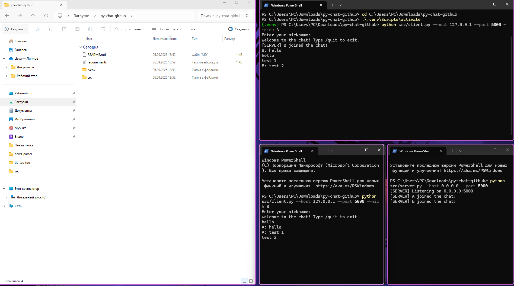

# Python Chat (Sockets)

## Описание
Простой многопользовательский чат на Python с использованием TCP-сокетов.

## Возможности
- Несколько клиентов одновременно
- Никнеймы
- Команды: /list, /quit

## Запуск

### Сервер
```bash
python src/server.py --host 0.0.0.0 --port 5000
```

### Клиент
```bash
python src/client.py --host 127.0.0.1 --port 5000 --nick Alice
python src/client.py --host 127.0.0.1 --port 5000 --nick Bob
```

## Автор
Li Vyacheslav

## 📸 Example

